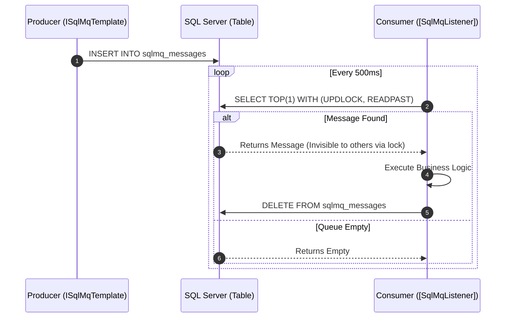

<div align="center">
  <h1>🚀 SqlMq for .NET</h1>
  <p><b>An idiomatic .NET 10 integration for Microsoft SQL Server based message queuing.</b></p>
</div>

<br/>

> 🚀 **Project Status: v0.2.0-beta (Core Resiliency Complete)**
> 
> This library implements advanced enterprise messaging patterns (Outbox, Exponential Backoff, Dead Letter Queues) directly on top of Microsoft SQL Server. It is actively being built for .NET 10.

---

> **Replace RabbitMQ or Azure Service Bus with SQL Server.** If your application already uses MS SQL Server (Azure SQL or on-premise), you can get highly reliable, distributed asynchronous messaging without deploying any new infrastructure.

This library acts as a native .NET 10 integration leveraging standard SQL Server tables and advanced row-locking mechanics (`WITH (UPDLOCK, READPAST)`). It provides an intuitive `[SqlMqListener]` attribute and a powerful `ISqlMqTemplate`, mirroring the developer experience of MassTransit or NServiceBus, while unlocking the ACID guarantees of SQL Server.

---

## ✨ Features at a Glance

- **Declarative Consumers:** Simply annotate methods with `[SqlMqListener("my_queue")]`.
- **Transactional Outbox Built-in:** Send messages safely within your standard EF Core `DbContext` transactions.
- **High Concurrency:** Built on SQL Server's `READPAST` hint, allowing multiple workers to poll the same table without deadlocks.
- **Poison Pill Handling:** Automatic routing to Dead Letter Queues (DLQ) after a configurable number of retries.
- **Exponential Backoff:** Circuit-break failing jobs by dynamically scaling visibility timeouts.
- **Delayed Messaging:** Schedule work for the future natively.
- **Native AOT Ready:** Fully compatible with .NET 10 Native AOT for lightning-fast startup in Azure Functions or containerized workloads.

---

## 🚀 Quick Start

### 1. Prerequisites
- .NET 10 SDK
- Microsoft SQL Server 2017+ or Azure SQL

### 2. Dependency
SqlMq is published to GitHub Packages. Add the NuGet packages to your project:

```bash
dotnet add package SqlMq
dotnet add package SqlMq.DependencyInjection
dotnet add package SqlMq.EntityFrameworkCore # Optional: For EF Core Outbox support
```

### 3. Configuration
Configure your queue in `Program.cs`:

```csharp
var builder = WebApplication.CreateBuilder(args);

builder.Services.AddSqlMq(options => {
    options.ConnectionString = builder.Configuration.GetConnectionString("DefaultConnection");
    options.AutoCreateSchema = true; // Automatically creates queue tables on startup
    options.DefaultVisibilityTimeout = TimeSpan.FromSeconds(30);
    options.DefaultPollInterval = TimeSpan.FromMilliseconds(500);
}, typeof(Program).Assembly); // Scan assembly for [SqlMqListener]

// Optional: Add EF Core integration
builder.Services.AddSqlMqEntityFrameworkCore<ApplicationDbContext>();

var app = builder.Build();
app.Run();
```

---

## 🛠️ Core Concepts

### Producing Messages (Transactional Outbox)

Inject `ISqlMqTemplate` into your services. If you configured EF Core integration, any messages sent will automatically enlist in the current `DbContext` transaction!

```csharp
using SqlMq.Abstractions;

public class OrderService
{
    private readonly ISqlMqTemplate _mqTemplate;
    private readonly ApplicationDbContext _dbContext;

    public OrderService(ISqlMqTemplate mqTemplate, ApplicationDbContext dbContext)
    {
        _mqTemplate = mqTemplate;
        _dbContext = dbContext;
    }

    public async Task ProcessOrder(Order order)
    {
        // Outbox Pattern: Save to database and enqueue message atomically!
        using var transaction = await _dbContext.Database.BeginTransactionAsync();
        
        _dbContext.Orders.Add(order);
        await _dbContext.SaveChangesAsync();

        // This message is only visible to consumers if the transaction successfully commits
        await _mqTemplate.SendAsync("order_queue", new OrderEvent(order.Id, "CREATED"));
        
        await transaction.CommitAsync();
    }
}
```

### Consuming Messages

Annotate a background worker method with `[SqlMqListener]`. The library registers an `IHostedService` that handles the background polling, JSON deserialization, and distributed locking.



```csharp
using SqlMq.Attributes;

public class OrderWorker
{
    // Consume just the payload
    [SqlMqListener("order_queue")]
    public async Task HandleOrderEvent(OrderEvent evt)
    {
        Console.WriteLine($"Processing order: {evt.OrderId}");
        
        // If this method returns normally, the message is deleted from the queue.
        // If it throws an Exception, the message is unlocked, the retry count is incremented,
        // and it is redelivered using exponential backoff.
    }
}
```

## 🎯 Common Use Cases

Why choose SQL Server for messaging instead of RabbitMQ or Azure Service Bus?

1. **The Outbox System:** Your primary data is in SQL Server. You need to save a database record and emit an event atomically. Using SqlMq avoids the notorious "Dual Write" problem entirely without needing complex CDC tools or distributed two-phase commits (DTC).
2. **Infrastructure Consolidation:** Your architecture has become bloated. Consolidating your message queue into your existing SQL Server instance drastically reduces infrastructure costs and cognitive load.
3. **High Performance via READPAST:** By utilizing `WITH (UPDLOCK, READPAST)`, SQL Server functions as an incredibly fast, highly-concurrent queue where competing consumers never block each other.

---

## 🤝 Contributing
Contributions are welcome as we build out this .NET 10 port!
